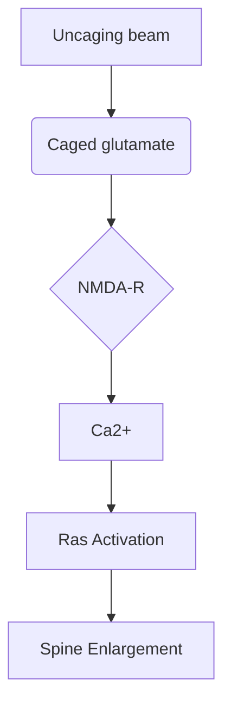

REPORTS

The strain sensitivity of myosin is most clearly illustrated in a plot of kdet versus force (Fig. 2B), where it can be seen that kdet decreases >75-fold with ≤2 pN of resisting force. The low forces experienced by myosin in the absence of the isometric clamp (Fig. 1B, Fig. 1B) is a 1-fold decrease in kdet is predicted over the unloaded rate (kdet) which is consistent with the values of force-bearing state termed the duty ratio, and the force dependence of the duty ratio can be calculated as

$$\text{duty ratio}(F) = \frac{k_{\text{att}}}{k_{\text{att}} + k_{\text{det}}(F)}$$

where katt is the rate of entry into the strong binding states. katt cannot be determined directly from the force time courses but can be estimated from the rate of phosphate release (katt = 0.38 s−1, Fig. S3). Myosin transforms from a low-duty-ratio motor (<0.2) to a high-duty-ratio motor (>0.5) when working against as little as 0.5 pN of force and it approaches the duty ratio of processive myosins (>0.9) at forces as low as 1.5 pN (Fig. 2B, inset).

We investigated the effect of force on the lifetimes and force amplitudes of the working-stroke substeps. Interactions measured in the presence of 50 μM ATP into bins based on the force immediately before detachment, and individual interactions were synchronized at their end times and ensemble-averaged. Transient increases in force due to substeps were observed in the 500 ms before detachment in all force bins (Fig. 3A). Single exponential fits of the time courses yielded rates that decreased with increasing force (Fig. 3B). The force dependence of the rates was fit to the equation

$$k_{\text{det}}(F) = k_{\text{det0}}e^{-\frac{F}{d_{\text{det}}}}$$

where kdet0 is the rate of the time course in the absence of force and ddet is the distance parameter for the substep (Fig. 3B). The best-fit rate of kdet0 (22 ± 2.5 s−1) is consistent with the rate of 50 μM ATP binding in the absence of resisting loads (kdet = 24 s−1, Fig. 1C), and the value ddet = 2.5 ± 0.83 nm is much smaller than datt (Fig. 2B). Therefore, the ATP binding step is the force-dependent step that limits the rate of actomyosin detachment. ADP release is the most likely candidate for the force-dependent transition (Fig. 3C). ddet is substantially larger than the size of the substep that correlates with ADP release (3.3 ± 0.35 nm, Fig. 1B), indicating that the force-sensitive transition state is not on a coordinate that is line with a rigid lever arm rotation (24).

The presence of a substep in the end-times in all force bins indicates that actomyosin detachment did not occur before ADP release, even at forces where the detachment rate is force-insensitive (> 1.5 pN; Fig. 2). The force-independent detachment rate (ki in Eq. 1) is probably the result of accelerated detachment due to force fluctuations in the system. Decreases in force before the ADP-release substep are observed in the force-binned start and end-time averages (fig. S4). Thus, when force transiently drops, there is an exponentially higher probability of ADP release (Fig. 2B), which is followed by rapid ATP binding and detachment.

Our results show that myosin I responds to small resisting loads (<2 pN) by dramatically increasing the actin-attachment lifetime more than 75-fold. This impressive tension sensitivity supports models that identify myosin I as the adaptation motor in mechanosensory hair cells (2, 3). More generally, the load-dependent kinetics support a model in which myosin I's function to generate and sustain tension for extended periods rather than to rapidly transport cargo (fig. S5). This new understanding of myosin I mechanics allows a more rigorous assignment of this motor's molecular roles in controlling organelle morphology (δ) and dynamics (5) in the wide variety of cells types in which it is expressed.

## References and Notes

1. J. S. Berg, B. C. Powell, R. E. Cheney, *Mol. Biol. Cell* **12**, 780 (2001).
2. J. R. Holt *et al.*, *Cell* **108**, 371 (2002).
3. C. Barrera, J. I. Molody, L. Coluccio, J. E. Molloy, *Philos. Trans. R. Soc. London Ser. B* **359**, 1895 (2004).
4. P. G. Gillespie, J. L. Cyr, *Annu. Rev. Physiol.* **66**, 521 (2004).
5. A. Bose *et al.*, *Nature* **420**, 821 (2002).
6. R. E. McConnell, M. J. Tyska, J. *Cell Biol.* **177**, 671 (2007).
7. D. E. Hokanson, J. M. Lasko, T. Lin, D. Sept, E. M. Ostap, *Mol. Biol. Cell* **17**, 4856 (2006).
8. L. Sakae-Cortes et al., *J. Cell Sci.* **118**, 4823 (2005).
9. N. A. Geeves, C. Perreault-Micale, L. M. Coluccio, *J. Biol. Chem.* **275**, 21624 (2000).
10. C. Veigel *et al.*, *Nature* **398**, 530 (1999).
11. J. D. Jena, *Nature* **378**, 751 (1995).
12. R. F. Spudich, M. O. Wiseman, H. D. White, *J. Biol. Chem.* **260**, 915 (1985).
13. J. H. Lowis, T. Lin, D. E. Hokanson, L. M. Ostap, *Biochemistry* **44**, 12689 (2006).
14. C. Veigel, S. Schmitz, F. Wang, J. R. Sellers, *Nat. Cell Biol.* **7**, 861 (2005).
15. J. T. Finer, R. M. Simmons, J. A. Spudich, *Nature* **368**, 113 (1994).
16. T. Lin, N. Tang, E. M. Ostap, J. *Biol. Chem.* **280**, 41562 (2005).
17. See methods in supporting information on *Science* Online.
18. C. Veigel, J. E. Molloy, S. Schmitz, J. Kendrick-Jones, *Nat. Cell Biol.* **5**, 980 (2003).
19. D. M. Warshaw et al., *J. Biol. Chem.* **275**, 37167 (2000).
20. C. Engert, R. Neumann, W. Hammer, J. Cell Biol. **120**, 1393 (1993).
21. V. Vogel, E. Homsher, Y. E. Goldman, H. Shuman, *Biophys. J.* **90**, 1295 (2006).
22. C. L. Berger, *Science* **200**, 618 (1978).
23. D. Altman, H. L. Sweeney, J. A. Spudich, *Cell* **116**, 737 (2004).
24. D. Tyggankov, M. E. Fisher, *Proc. Natl. Acad. Sci. U.S.A.* **104**, 12321 (2007).
25. We thank T. Lin for technical assistance and Y. E. Goldman for helpful discussions. Supported by NIH grants AR051174 (H.S. and E.M.O.) and GM057247 (E.M.O.).

## Supporting Online Material

www.sciencemag.org/cgi/content/full/321/5885/133/DC1

Materials and Methods

Figs. S1 to S5

References

*21 April 2008; accepted 9 June 2008*

*10.1126/science.1159419*

---

# The Spread of Ras Activity Triggered by Activation of a Single Dendritic Spine

Christopher D. Harvey,1,2* Ryohei Yasuda,2,3*† Haining Zhong,1,2 Karel Svoboda1,2*†

In neurons, individual dendritic spines isolate N-methyl-D-aspartate (NMDA) receptor–mediated calcium ion (Ca2+) accumulations from the dendrite and other spines. However, the extent to which spines compartmentalize signaling events downstream of Ca2+ influx is unknown. We combined two-photon fluorescence lifetime imaging with two-photon glutamate uncaging to image the activity of the small guanosine triphosphatase after NMDA receptor activation at individual spines. Induction of long-term potentiation (LTP) triggered robust Ca2+-dependent Ras activation in single spines that decayed in ~5 minutes. Ras activity spread to 10 micrometers of dendrite and invaded neighboring spines by diffusion. The spread of Ras-dependent signaling was necessary for the local regulation of the threshold for LTP induction. Thus, Ca2+-dependent synaptic signals can spread to couple multiple synapses on short stretches of dendrite.

Dendritic spines, small (<1 μm) protrusions emanating from the dendritic shaft, are the sites of most excitatory synapses in the mammalian brain (1). Spines function as biochemical compartments (2, 3) that isolate post-synaptic Ca2+ accumulations (4–6). Ca2+ influx through synaptic N-methyl-D-aspartate (NMDA) receptors (NMDA-Rs) activates a complex sig-

136                                    4 JULY 2008    VOL 321    SCIENCE    www.sciencemag.org

REPORTS

naling network (7), including the small guanosine triphosphatase (GTPase) H-Ras (8–10), to induce long-term potentiation (LTP) of synaptic transmission (11, 12). LTP is input specific (13), suggesting that important Ca2+-dependent signals remain confined to single spines. In contrast, synapses interact through diffusible cytoplasmic factors (14–16). Which signals downstream of NMDA-R–dependent Ca2+ influx are restricted to individual spines? To begin to address this question, we imaged the dynamics of Ras activity during the induction of input-specific LTP.

We transfected pyramidal neurons in organotypic hippocampal slices with a fluorescence resonance energy transfer (FRET)–based indicator of Ras activation, FRas-F, consisting of H-Ras tagged with monomeric enhanced green fluorescent protein (mEGFP) and the Ras-binding domain [RBD, R59A (mutation of Arg59 to Ala)] of Raf tagged with two monomeric red fluorescent proteins (mRFPs) (Fig. 1A) (17). Upon Ras activation, the affinity between Ras and RBD increases, leading to FRET between the donor and acceptor fluorophores (Fig. 1A) (17–19). FRas-F is rapidly reversible and reports the time course of endogenous Ras activation (17). We imaged FRET by using two-photon fluorescence lifetime imaging (2pFLIM) (17, 20, 21). To quantify Ras activation, we computed the fraction of Ras molecules binding to RBD (binding fraction) (Fig. 1B) (17, 22).

To induce synapse-specific plasticity, we applied a train of two-photon glutamate uncaging pulses (30 pulses at 0.5 Hz) to a single spine in a low concentration (nominally 0 mM) of extracellular Mg2+ (13, 16). Each uncaging pulse produced transient changes in the concentration of calcium ([Ca2+]) and NMDA-R–mediated currents (7.3 ± 0.6 pA, corresponding to the opening of about five NMDA-Rs), similar to those triggered by low-frequency synaptic stimulation (fig. S1) (6, 22, 23). Uncaging-evoked [Ca2+] accumulations were restricted mostly to the heads of the stimulated spines (fig. S1, A to E) (22). The uncaging train caused a sustained spine enlargement in the stimulated spine; neighboring spines less than 4 μm away did not change (Fig. 1, C to E) (13, 16). The increase in spine volume was proportional to an enhancement in postsynaptic sensitivity to glutamate, indicating that spine enlargement is a structural correlate of LTP (fig. S2C) (13, 16, 24).

The uncaging train induced robust Ras activation in the stimulated spine (Fig. 1, C, F, and G), which peaked within 1 min after the stimulus and returned to baseline levels within 15 min (decay time constant of Ras activation, τdecay = 5.6 ± 0.5 min). Ras activation required Ca2+ influx through NMDA-Rs (Fig. 1H) (8–10). Ras activation also required the activity of multiple signaling factors; inhibitors of calcium/calmodulin-dependent protein kinase II (CaMKII; 10 μM KN62), phosphoinositide 3-kinase (PI3K; 20 μM LY294002), or protein kinase C (PKC; 1 μM Gö6976) signaling reduced Ras activation (Fig. 1H and fig. S3D) (11, 22, 25). The amplitudes of Ras activation and sustained spine enlargement were correlated (fig. S4A). Expression of a dominant-negative form of FRas-F [Ras S17N (mutation of Ser17 to Asn)] or inhibition of extracellular signal–regulated kinase (ERK) activation [mitogen-activated protein kinase (MAPK) kinase (MEK) blocker; 10 μM U0126] reduced the magnitude of sustained spine enlargement (fig. S4F) (22). Ras-ERK activation, therefore, was necessary for the persistent increase in spine volume, confirming the role of Ras signaling in synaptic plasticity (11). CaMKII activity, PKC signaling, and actin polymerization were also required for spine structural plasticity (fig. S4F) (13, 22).

We next characterized the spatial profile of Ras activation (Figs. 1, F and G, and 2, A and B). After the plasticity-inducing stimulus, Ras activity spread over several micrometers in both directions along the parent dendrite and invaded nearby spines (length constant, L ≈ 11 μm at 4 min) (Fig. 2B), suggesting that Ras signaling is not synapse specific.

Could the presence of the Ras sensor distort the spatial profile of Ras activity? The mean distance active Ras travels before it is inactivated, L, depends on the effective diffusion coefficient of Ras, D, and the time constant of Ras inactivation, τinactivation (22):

$$L \sim \sqrt{D \tau_{\text{inactivation}}} \quad (1)$$

FRas-F expression could increase D and τinactivation by saturating Ras scaffolds and Ras inactivators

[The image contains a composite figure labeled Fig. 1 with sub-panels A through H.]

**Fig. 1. Ras activation in individual dendritic spines during plasticity induction.** **(A)** Experimental geometry. **(B)** Schematic of fluorescence decay curves after pulsed excitation. Slow and fast components correspond to free donor and donor bound to acceptor, respectively. FRET decreases fluorescence lifetime. **(C)** Fluorescence lifetime images of Ras activity. At time = 0, 30 uncaging pulses (0.5 Hz) were applied to the spine marked by the arrowhead in a low concentration (nominally 0 mM) of extracellular Mg2+. "Warmer" colors indicate shorter lifetimes and higher levels of Ras activation. **(D)** Changes in spine volume. Colors correspond to the circles in (C). Arrow, time of stimulus. **(E)** Spine volume changes for the stimulated and nearby (<4 μm) spines (-5 to 20 min: 91 spines; >20 min: 9 spines, mean ± SEM). ΔVolsustained is the volume difference between 15.5 and 19.5 min and the baseline volume. **(F)** Ras activation. Colors correspond to the circles in (C). **(G)** Ras activation in the stimulated and nearby spines (82 spines, mean ± SEM). **(H)** Pathways to Ras activation. Ras activation was the average binding fraction at 1 to 3 min minus baseline, normalized to the control condition. Numbers of spines: 82 Ctrl, 11 Low [Ca2+]ex (200 μM), 12 CPP (10 μM), 27 KN62 (10 μM), 20 LY294002 (20 μM), and 23 Gö6976 (1 μM). Error bars indicate mean ± SEM. *P < 0.05 versus control.

1Janelia Farm Research Campus, Howard Hughes Medical Institute, Ashburn, VA 20147, USA. 2Watson School of Biological Sciences, Cold Spring Harbor Laboratory, Cold Spring Harbor, NY 11724, USA. 3Neurobiology Department, Duke University Medical Center, Durham, NC 27710, USA.
*These authors contributed equally to this work.
†To whom correspondence should be addressed. E-mail: yasuda@neuro.duke.edu, svobodak@janelia.hhmi.org

www.sciencemag.org SCIENCE VOL 321 4 JULY 2008 137

REPORTS

(GTPase-activating proteins, GAPs), respectively. In addition, RBD competes with GAPs for binding to Ras, further increasing $\tau_{\text{inactivation}}$ (17). To determine if FRas-F expression increases the spread of Ras activation (fig. S5) (22), we modulated FRas-F levels by changing the duration of expression and imaged Ras activation. We quantified FRas-F expression by using post hoc immunofluorescence measurements (fig. S6) (22). Ras activation spread along the dendrite even at the lowest FRas-F expression levels tested (~1.5-fold Ras overexpression) (Fig. 2, C and D). Furthermore, the spatial profile of Ras activity was similar across a wide range of FRas-F concentrations (Fig. 2, C and D). FRas-F expression, therefore, did not distort the spatial spread of Ras activation.

We next investigated the mechanisms underlying the spread of Ras activity. Ras mobility could be a major determinant of the spread of Ras activity (Eq. 1). To measure mobility directly, we expressed H-Ras tagged with photoactivatable GFP (paGFP-Ras) (26) together with the cytoplasm marker mCherry. After photoactivation in single spines, the spine fluorescence decayed over seconds ($\tau = 4.17 \pm 0.40\text{ s}$), similar to the decay rate of membrane-targeted paGFP and less than one-tenth the decay rate of cytosolic paGFP (Fig. 3, A and B) (3). These measurements suggest that Ras diffuses relatively freely within the plasma membrane. Constitutively active Ras [Ras G12V (mutation of Gly12 to Val)] diffused at a rate similar to that of wild-type Ras (Fig. 3B) and had similar mobility with or without RBD expression (22); Ras activation and the binding of RBD to Ras, therefore, did not alter Ras diffusion appreciably. Near physiological temperatures (33°C), Ras mobility was enhanced by a factor of ~2, likely as a result of changes in membrane viscosity (Fig. 3B) (27). Within 30 s after photoactivation, more than 90% of the paGFP-Ras G12V fluorescence had decayed from the spine head (Fig. 3D). A similar fraction of membrane-targeted paGFP remained in the spine after 30 s (Fig. 3D). These studies imply that no major immobile fraction of active Ras exists in the spine. Ras overexpression could enhance diffusion by saturating Ras scaffolds (fig. S5A) (22, 28). However, the decay time constant and the fraction of fluorescence remaining in the spine at 30 s were independent of paGFP-Ras G12V expression levels (Fig. 3, C and E). These data indicate that active endogenous Ras is highly mobile and does not associate strongly with immobile scaffolds in the spine.

The time constant of Ras inactivation could also modulate the spread of Ras activity (Eq. 1). Because the decay of Ras activity following uncaging stimuli includes both Ras inactivation and diffusion, we instead measured Ras inactivation after brief trains of back-propagating action potentials (bAPs), which activate Ras globally (Fig. 3, F and G) (17). Because the length constant of Ras diffusion (~10 $\mu$m) (Fig. 2B) is much longer than interspine distances, Ras molecules

**Fig. 2. Spatial spread of Ras activity.** (**A**) Fluorescence lifetime images of Ras activity. At time = 0, LTP was induced at the spine marked by an arrowhead. (**B**) The spatial spread of Ras activation at different time points. Black circles indicate distances along the dendrite relative to the stimulated spine (gray circle; $n = 11$ cells, mean $\pm$ SEM). The solid line shows the fitted profile of Ras activation derived from a one-dimensional diffusion-reaction model (22). (**C**) The spatial spread of Ras activation (Ras activation, normalized to peak Ras activation in the stimulated spine, 2 min after stimulus) at various expression levels. (**D**) Normalized Ras activation 3 to 5 $\mu$m from the stimulated spine. $r = 0.36$, $P > 0.3$, $n = 8$ cells.

**Fig. 3. Ras mobility and the time constant of Ras inactivation.** (**A**) Left: Spine before and after photoactivation (green, paGFP-Ras; red, mCherry). Right: Time course of activated paGFP-Ras in the spine (black) and parent dendrite (blue). (**B**) Decay time constants of paGFP fluorescence in the photoactivated spine. Horizontal bars, mean. Numbers of spines: 17 cytosolic, 46 membrane, 21 Ras, 84 Ras G12V, 52 Ras G12V (33°C). *$P < 0.05$ versus paGFP-Ras G12V (23°C). (**C**) Decay time constants of paGFP-Ras G12V fluorescence at varying expression levels. $r = -0.05$, $P > 0.8$, $n = 13$ cells. (**D**) Fraction of paGFP fluorescence remaining in the spine 30 s after photoactivation. Horizontal bars, mean. Number of spines: 46 membrane, 84 Ras G12V. $P > 0.7$. (**E**) Fraction of paGFP-Ras G12V fluorescence remaining in the spine at 30 s at varying expression levels. $r = 0.25$, $P > 0.4$, $n = 13$ cells. (**F**) Fluorescence lifetime images before and after trains of bAPs (40 APs at 83 Hz, repeated four times every 5 s). (**G**) Time course of Ras activation for the experiment shown in (F). Arrows, AP stimuli. (**H**) $\tau_{\text{inactivation}}$ at 23°C and 33°C. Ras inactivation was measured at both temperatures in individual cells. $n = 5$ cells, $P < 0.001$. (**I**) Ras inactivation at varying expression levels. $r = 0.8$, $P < 0.01$, slope = 0.6 min per fold overexpression, intercept = 2.9 min. $n = 12$ cells.

### Figure 2 Data Representation
<table>
  <thead>
    <tr>
        <th>Time Point</th>
        <th>Distance (μm)</th>
        <th>Ras activation (Binding fraction)</th>
    </tr>
  </thead>
  <tbody>
    <tr>
        <td>-1 min</td>
        <td>0 to 20</td>
        <td>~0.05 to 0.10</td>
    </tr>
    <tr>
        <td>2 min</td>
        <td>0 to 20</td>
        <td>Peak ~0.25 at 0 μm, decaying to ~0.05 at 20 μm</td>
    </tr>
    <tr>
        <td>4 min</td>
        <td>0 to 20</td>
        <td>Peak ~0.15 at 0 μm, decaying to ~0.05 at 20 μm</td>
    </tr>
    <tr>
        <td>7 min</td>
        <td>0 to 20</td>
        <td>Peak ~0.12 at 0 μm, decaying to ~0.05 at 20 μm</td>
    </tr>
  </tbody>
</table>

### Figure 3 Data Representation
<table>
  <thead>
    <tr>
        <th>Condition</th>
        <th>Decay time constant τ (s)</th>
        <th>Fraction remaining at 30 s</th>
    </tr>
  </thead>
  <tbody>
    <tr>
        <td>Cytosolic paGFP</td>
        <td>~0.1 to 0.5</td>
        <td>N/A</td>
    </tr>
    <tr>
        <td>Membrane paGFP</td>
        <td>~1 to 10</td>
        <td>~0.05 to 0.15</td>
    </tr>
    <tr>
        <td>Ras (WT)</td>
        <td>~1 to 10</td>
        <td>N/A</td>
    </tr>
    <tr>
        <td>Ras G12V (23°C)</td>
        <td>~1 to 10</td>
        <td>~0.05 to 0.15</td>
    </tr>
    <tr>
        <td>Ras G12V (33°C)</td>
        <td>~0.5 to 5</td>
        <td>N/A</td>
    </tr>
  </tbody>
</table>

138 4 JULY 2008 VOL 321 SCIENCE www.sciencemag.org
Downloaded from https://www.science.org at Universit de Montral on February 28, 2026

REPORTS

activated in both dendrites and spines sample the same population of GAPs, independent of the stimulus. After trains of bAPs, Ras activity decayed over minutes ($\tau_{\text{inactivation}} = 4.5 \pm 0.4 \text{ min}$) (Fig. 3G) (*17*). Near physiological temperatures (33°C), $\tau_{\text{inactivation}}$ was decreased by a factor of ~2 (Fig. 3H). Because this reduction in $\tau_{\text{inactivation}}$ was similar to the enhancement of Ras mobility (Fig. 3B), the spread of Ras activity is likely to be relatively independent of temperature (Eq. 1). The duration of Ras activity may be prolonged by FRas-F expression (fig. S5, B and C) (*22*). However, $\tau_{\text{inactivation}}$ was only weakly dependent on FRas-F expression levels (Fig. 3I). Extrapolation to the native case gave $\tau_{\text{inactivation}} \sim 2.9 \text{ min}$ (Fig. 3I). Because RBD and exogenous Ras levels were correlated ($r = 0.89, P < 0.001$), the estimation of $\tau_{\text{inactivation}}$ takes into account the effects of both exogenous Ras and RBD expression. FRas-F therefore increased $\tau_{\text{inactivation}}$ by a factor of ~2 and thus the spatial spread by a factor of ~1.5 (Eq. 1). Active Ras in the native case is therefore expected to spread by diffusion over ~10 $\mu$m of dendrite, invading 10 to 20 synapses (*22*).

To address whether diffusion of active Ras by itself can quantitatively explain the spread of Ras activity, we modeled the spread of Ras activation using a one-dimensional diffusion-reaction model. In the model, Ras is activated by stationary guanine nucleotide exchange factors (GEFs) in the stimulated spine and is inactivated by GAPs that are distributed homogeneously along the dendrite. By fitting our spatial Ras activity data (Fig. 2B) using a global regression analysis, we obtained estimates of the time constant of GEF activity, $\tau_{\text{GEF}} = 2.0 \text{ min}$, $\tau_{\text{inactivation}} = 4.5 \text{ min}$, and $D = 0.65 \text{ }\mu\text{m}^2/\text{s}$. These estimates of $\tau_{\text{inactivation}}$ and $D$ are identical to the values measured independently (Fig. 3) (*22, 29*). We conclude that the spread of Ras activation can be explained by the rapid diffusion of active Ras.

What could be the function of the spread of Ras activation? Induction of LTP at a single synapse reduces the threshold for potentiation at neighboring synapses (*16*). Because the time scales (~5 min) and length scales (~10 $\mu$m) of Ras signaling and synaptic crosstalk (*16*) are identical, we tested whether the spread of Ras activity is critical for the local modulation of the LTP induction threshold.

In a synaptic crosstalk experiment, LTP is induced at one spine (LTP spine) with a train of uncaging pulses; subsequently, a subthreshold uncaging protocol, which by itself is too weak to trigger plasticity (fig. S7C), is sufficient to induce functional and structural plasticity in a neighboring spine (sub spine) (*16*). If the spread of Ras activity is necessary for crosstalk, Ras-dependent signaling is likely required at a later time in the sub spine as compared to the LTP spine. We induced LTP at a single spine and a short time (3 min) later locally applied a MEK inhibitor (20 $\mu$M U0126) to block Ras-ERK signaling; the inhibitor did not decrease the sustained spine-volume change in the LTP spine appreciably (Fig. 4, B to D). We then stimulated a neighboring spine with the subthreshold protocol. The MEK inhibitor substantially reduced the sustained spine enlargement in the sub spine (Fig. 4, B to D), indicating that Ras-dependent signaling is necessary for crosstalk in plasticity.

Ras activity in the sub spine could be caused exclusively by the spread of Ras activity from the LTP spine, but may also include Ras directly activated in the sub spine by the subthreshold protocol. However, the subthreshold protocol alone did not induce detectable Ras activation (fig. S7B). Similarly, in the crosstalk stimulus paradigm, the subthreshold protocol did not trigger additional Ras activation in the sub spine; the decay of Ras activation triggered by the LTP protocol was similar with and without application of the subthreshold protocol (compare Figs. 1G and 4E) (*22*). Furthermore, the magnitude of Ras activation in the sub spine before the subthreshold protocol, due to the spread of Ras activity, was correlated with the sustained spine enlargement in the sub spine (Fig. 4F). Together, these data indicate that the spread of Ras-dependent signaling is necessary for the local regulation of the LTP induction threshold.

We have shown that Ras signaling after LTP induction spreads along 10 $\mu$m of dendrite and invades neighboring spines. The time scale of Ras inactivation was on the order of minutes, as compared with a spine-dendrite diffusional coupling time of seconds. Active Ras can therefore diffuse out of the spine head into the dendrite before inactivating. In contrast, Ca2+ is highly compartmentalized because it is extruded much more rapidly (tens of milliseconds) than the diffusional relaxation time between spine and dendrite (hundreds of milliseconds) (*6*). The diffusional barrier created by the narrow spine neck (*2, 3*) may be important for rapid signals, such as Ca2+, but is likely less significant for other diffusible signals with longer durations. Synapse-specific plasticity presumably is achieved by signaling molecules that are strongly tethered to postsynaptic scaffolds. The spread of Ca2+-dependent signaling and local functional interactions at the level of plasticity (*16*) indicate that neighboring synapses are co-regulated. Synapses sharing a short stretch of dendrite may therefore form functional units within individual neurons (*30*).

**Fig. 4. Spread of Ras signaling and synaptic crosstalk.** **(A)** Time-lapse images of a GFP-expressing pyramidal neuron in an acute hippocampal brain slice. At time = 0, 30 uncaging pulses (0.5 Hz, 4-ms pulse duration, LTP protocol) were applied to the spine marked by a white arrowhead (LTP spine) in a low concentration (nominally 0 mM) of extracellular Mg2+. At time = 3 min, vehicle (0.1% dimethyl sulfoxide) was pressure applied locally from a glass pipette until time = 17 min. At time = 5.5 min, the subthreshold protocol (30 uncaging pulses, 0.5 Hz, 1-ms pulse duration) was applied to a nearby spine (sub spine, red arrowhead). **(B)** Spine-volume changes in the vehicle condition (11 spines, mean ± SEM). **(C)** Spine-volume changes in the 20 $\mu$M U0126 condition (11 spines, mean ± SEM). **(D)** Sustained changes in spine volume. Error bars indicate mean ± SEM. *P < 0.05. **(E)** Ras activation in the LTP and sub spines during the crosstalk paradigm in cultured hippocampal slices. At time = 0, the LTP protocol was applied to the LTP spine, and 3.5 min later, the subthreshold protocol was applied to the sub spine (13 spines, mean ± SEM). **(F)** Relation between Ras activation and the sustained spine enlargement in the sub spine during crosstalk. $\Delta$Binding fraction was measured before the subthreshold protocol (1.5 to 3.5 min after the LTP protocol). $r = 0.54, P = 0.05$.

### References and Notes
1. E. A. Nimchinsky, B. L. Sabatini, K. Svoboda, *Annu. Rev. Physiol.* **64**, 313 (2002).
2. K. Svoboda, D. W. Tank, W. Denk, *Science* **272**, 716 (1996).
3. B. L. Bloodgood, B. L. Sabatini, *Science* **310**, 866 (2005).
4. W. Müller, J. A. Connor, *Nature* **354**, 73 (1991).
5. R. Yuste, W. Denk, *Nature* **375**, 682 (1995).
6. B. L. Sabatini, T. G. Oertner, K. Svoboda, *Neuron* **33**, 439 (2002).
7. M. B. Kennedy, H. C. Beale, H. J. Carlisle, L. R. Washburn, *Nat. Rev. Neurosci.* **6**, 423 (2005).
8. M. J. Kim, A. W. Dunah, Y. T. Wang, M. Sheng, *Neuron* **46**, 745 (2005).
9. X. Tian *et al.*, *EMBO J.* **23**, 1567 (2004).
10. H. Y. Yun, M. Gonzalez-Zulueta, V. L. Dawson, T. M. Dawson, *Proc. Natl. Acad. Sci. U.S.A.* **95**, 5773 (1998).
11. J. J. Zhu, Y. Qin, M. Zhao, L. Van Aelst, R. Malinow, *Cell* **110**, 443 (2002).
12. R. C. Malenka, M. F. Bear, *Neuron* **44**, 5 (2004).
13. M. Matsuzaki, N. Honkura, G. C. Ellis-Davies, H. Kasai, *Nature* **429**, 761 (2004).
14. S. Tsuriel *et al.*, *PLoS Biol.* **4**, e271 (2006).
15. N. W. Gray, R. M. Weimer, I. Bureau, K. Svoboda, *PLoS Biol.* **4**, e370 (2006).
16. C. D. Harvey, K. Svoboda, *Nature* **450**, 1195 (2007).

www.sciencemag.org SCIENCE VOL 321 4 JULY 2008 139

REPORTS

## References

17. R. Yasuda et al., Nat. Neurosci. 9, 283 (2006).
18. N. Mochizuki et al., Nature 411, 1065 (2001).
19. O. Deiß et al., Science 307, 1746 (2005).
20. D. W. Piston, D. Sandison, W. W. Webb, in Time-Resolved Laser Spectroscopy in Biochemistry, J. R. Lakowicz, Ed. (SPIE, Bellingham, WA, 1992), pp. 379–389.
21. E. Gorelik, S. Brickmann, J. Sohn, O. Gutman, N. Barry, J. Biomed. Opt. 8, 181 (2003).
22. Supplementary online material is available on Science Online.
23. L. Luo, E. M. Callaway, K. Svoboda, Neuron 50, 799 (2006).
24. C. D. Kopec, J. H. Wei, J. Wert, B. Malinow, J. Neurosci. 26, 2000 (2006).
25. M. Scanziani, J. Bandara, T. Inoue, T. Meyer, Curr. Biol. 14, 44 (2008).

26. G. H. Patterson, J. Lippincott-Schwartz, Science 297, 1873 (2002).
27. H. Kano, T. L. Neetjes, Nat. Cell Biol. 3, E145 (2001).
28. H. Hiv, O. Gutman, Y. Kloog, Y. I. Henis, J. Cell Biol. 157, 865 (2002).
29. P. H. Lommerse et al., Biophys. J. 86, 609 (2004).
30. A. Kusumi, Y. Sako, M. Yamamoto, J. C. Magee, Nature 434, 236 (2005).
31. We thank N. Ghitani, B. Burbach, C. Zhang, B. Shields, and M. White for technical assistance; N. Gee for help with immunostaining; L. van Aelst for helpful discussions; T. Dittman for comments on the manuscript. This work was supported by the Howard Hughes Medical Institute, NIH, a David and Fanny Luke Fellowship (C.D.H.), Burroughs Wellcome Fund (R.Y.), National Alliance for Autism Research (R.Y.), National Institute of Mental Health (R.Y.), and National Alliance for Research on Schizophrenia and Depression (R.Z.).

## Supporting Online Material

www.sciencemag.org/cgi/content/full/1159675/DC1

### SOM Text

Figs. S1 to S12

### References

28 April 2008; accepted 28 May 2008
Published online 12 June 2008;
10.1126/science.1159675

Include this information when citing this paper.

---

# Finite Scale of Spatial Representation in the Hippocampus

Kirsten Brun Kielstrup,1 Trygve Solstad,1 Vegard Heimly Brun,1 Torkel Hafting,1 Stefan Leutgeb,1 Henning F. Witter,1,2 Edvard I. Moser,1* May-Britt Moser1

To determine how spatial scale is represented in the pyramidal cell population of the hippocampus, we recorded neural activity at multiple longitudinal levels of this brain area while rats ran back and forth on an 18-meter-long linear track. CA3 cells had well-defined place fields at all levels. The scale of representation increased almost linearly from <1 meter at the dorsal pole to ~10 meters at the ventral pole. The results suggest that the place-cell map includes the entire hippocampus and that environmental representations are represented in the hippocampus at a topographically graded but finite continuum of scales.

Although the basic intrinsic circuitry of the hippocampus is similar along the entire dorsoventral axis of the structure (1), dorsal and ventral regions may have similar functions. Dorsal and intermediate regions preferentially connected, via the dorsolateral and intermediate bands of the entorhinal cortex, to visual and somatosensory cortices important for accurate spatial navigation (2–5), and selective lesions in these hippocampal regions can lead to impairments in spatial learning (6–8). Pyramidal cells in these parts of the hippocampus have spatially selective firing fields that reflect the animal's location (9, 10) and jointly form a maplike representation of the environment (10–12). The scale of this representation increases from dorsal to intermediate hippocampus (13, 14), matching the progressive dorsoventral increase in the spacing of grid cells in medial entorhinal cortex, one synapse upstream (15, 16). In contrast, the ventral one-third of the hippocampus has strong connections with a restricted number of interconnected areas of the lateral septum, hypothalamus, and amygdala, both directly and through the ventromedial portions of the entorhinal cortex.

(2, 17–19). Selective lesions of the ventral hippocampus affect autonomic and defensive responses but not basic spatial behaviors (20, 21). Collectively, these studies imply a functional division in the hippocampus where the dorsal and intermediate parts are more relevant for spatial behavior and the ventral part is more relevant for emotional and motivational processes. However, such a division does not rule out the possibility that location is represented at all levels of the hippocampus. Spatial inputs may reach even the most ventral cells via the associational networks of the hippocampus (22, 23) or by way of intrinsic connections between dorsal and ventral parts of the entorhinal cortex (1). To determine whether the ventral hippocampus also has place cells, we combined activity at multiple longitudinal levels of CA3 (21 place cells) (24). All recording sites were mapped onto the long axis of CA3 (fig. S1). The data were subdivided into three groups based on recording location (dorsal, 7 to 22%; intermediate, 40 to 70%; and ventral, 70 to 100%).

Conventional recording environments may be too small to visualize the most extended hippocampal representations (figs. S2 to S4 and supporting online text). Thus, we tested the animals on an 18-meter linear track. Well-delineated place fields, defined as spatially stable contiguous regions with firing above 20% of the peak rate, could be found at all longitudinal levels of the hippocampus (Fig. 1 and fig. S5). The representations scaled up between dorsal and ventral recording locations (Fig. 1), from an average place field size of 0.98 ± 0.03 m in dorsal hippocampus (mean ± SEM; 111 cells, five rats), to 3.73 ± 0.43 m in intermediate hippocampus (37 cells, three rats), and 5.52 ± 0.94 m in ventral hippocampus (61 cells, four rats). Few fields were longer than 10 m. The relation between recording location and field size was strong (dorsal versus intermediate versus ventral: F2,217 = 86.5, P < 0.001; pairwise comparisons significant at P < 0.001, Bonferroni test). Forty-five percent of the variance was explained by a linear regression model [r = 0.67, n = 111, P < 0.001; (fig. S6)]. There was a similar increase in the width of the central peak of the spatial autocorrelation function, measured at 20% of the peak value (dorsal, 1.12 ± 0.03 m; intermediate, 3.07 ± 0.19 m; and ventral, 4.10 ± 0.18 m; F2,227 = 179.8, P < 0.001; all pairwise comparisons significant at P < 0.001), in this case, 53% of the variance was explained by a linear regression model [r = 0.73, 111, P < 0.001; (fig. S6; supporting online text)].

The size of individual hippocampal place fields can also be estimated by exploiting the fact that place cells exhibit field phase precession (25). A place field can be defined as the area between the points on a track where the precession begins and terminates (26). Running on the 18-m track was associated with this rhythmicity and phase precession at all dorsoventral recording levels in CA3 (81 place cells; Fig. 2 and fig. S7). As the rat crossed the firing field, the firing phase advanced gradually, up to 360°, over successive cycles of the theta rhythm. The strength of precession was estimated for each firing field by rotating the phase by position distribution in steps of 1° across the phase cycle and fitting a linear regression line for each rotation (25, 27). The rotation that gave the largest explained variance was identified. The slope of the regression line at this rotation (phase change per unit of movement) decreased as the field size increased along the long axis of the hippocampus (Fig. 2). In the ventral CA3, the phase advance often occurred over distances as large as 10 m (Fig. 2, right). The mean regression slope changed from −102° ± 33° per meter in dorsal hippocampus (nD = 63, −3.1, P < 0.005) to −18° ± 9° per meter in intermediate and ventral hippocampus (t97 = 2.09, P < 0.05; group difference: t99 = 2.3, P < 0.05; intermediate and ventral cells were combined because

140                                    4 JULY 2008    VOL 321    SCIENCE    www.sciencemag.org

Science
NAAAS

# The Spread of Ras Activity Triggered by Activation of a Single Dendritic Spine
Christopher D. Harvey, Ryohei Yasuda, Haining Zhong, and Karel Svoboda

*Science* **321** (5885), . DOI: 10.1126/science.1159675

**View the article online**
https://www.science.org/doi/10.1126/science.1159675
**Permissions**
https://www.science.org/help/reprints-and-permissions

Use of this article is subject to the [Terms of service](https://www.science.org/help/terms-of-service)

*Science* (ISSN 1095-9203) is published by the American Association for the Advancement of Science. 1200 New York Avenue NW, Washington, DC 20005. The title *Science* is a registered trademark of AAAS.

American Association for the Advancement of Science

Downloaded from https://www.science.org at Universit de Montreal on February 28, 2026